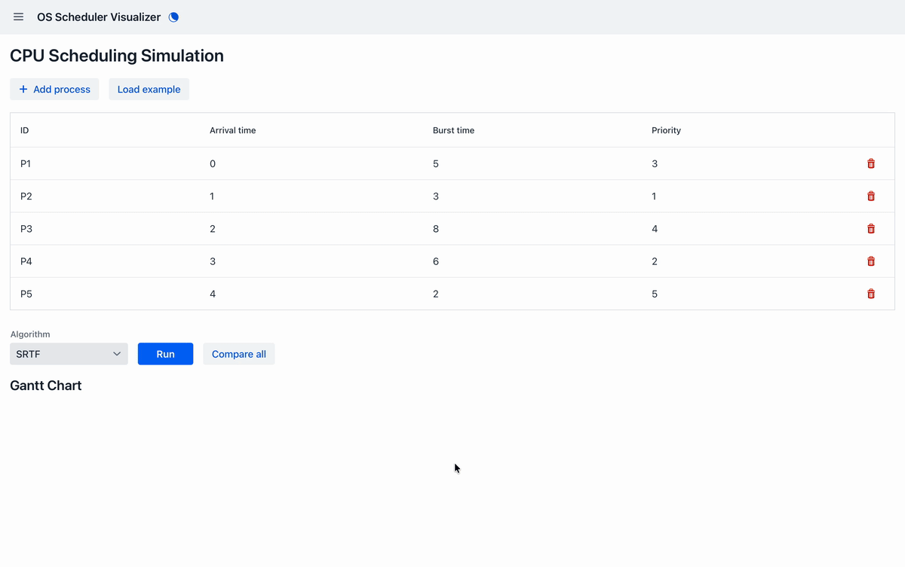
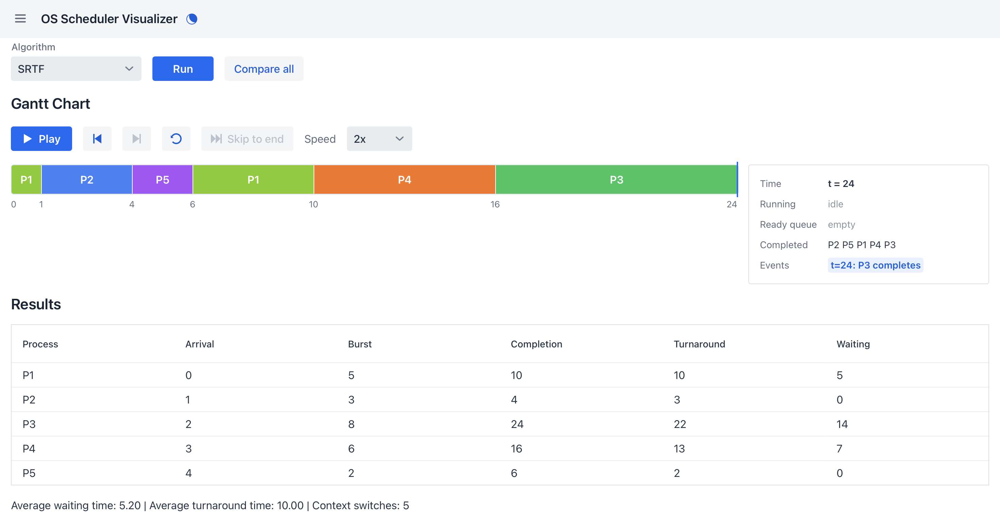
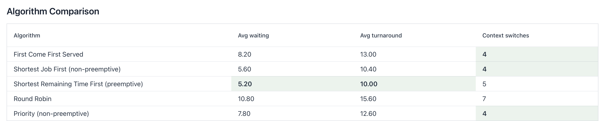
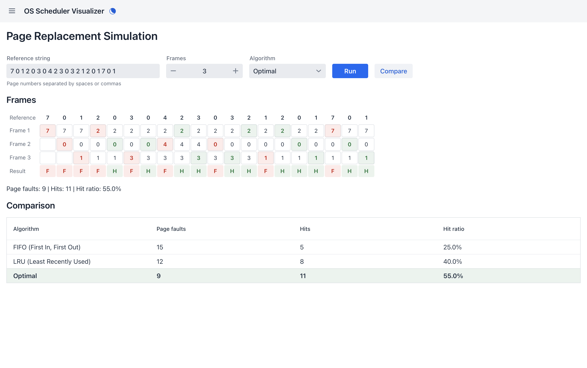

# OS Scheduler Visualizer

An interactive web app for exploring classic operating system algorithms: CPU scheduling and page replacement. Enter your own workload, run an algorithm and watch the schedule play out tick by tick.

Built with Vaadin and Spring Boot.



## Features

### CPU scheduling
- **Five algorithms:** First Come First Served, Shortest Job First (non-preemptive), Shortest Remaining Time First (preemptive), Round Robin (configurable quantum) and Priority (non-preemptive).
- **Editable workload:** add, remove and edit processes inline, or load a textbook example.
- **Gantt chart:** a timeline of which process ran when, including idle time.
- **Step-through playback:** play, pause, step forward and back, or skip to the end, at 0.5x, 1x or 2x speed. A side panel shows the running process, the ready queue and events (arrivals, preemptions, completions) at each tick.
- **Per-process metrics:** completion, turnaround and waiting time, plus averages and context switches.
- **Compare all:** runs every algorithm on the same workload and highlights the best value in each column.





### Page replacement
- **Three algorithms:** FIFO, LRU and Optimal.
- **Step grid:** frame contents for every reference, with faults and hits marked. Hover a fault to see which page was evicted.
- **Comparison:** fault counts and hit ratios for all three algorithms side by side.



### General
- **Light and dark mode:** toggle with the moon icon in the header.
- **Example data on load:** both views open with a textbook example, ready to run.

## Conventions

- **Priority:** a lower number means a higher priority.
- **Context switches:** counted as transitions between different processes in the Gantt chart.
- **Ties:** when several values tie for best in a comparison, all of them are highlighted.

## Tech stack

| Layer | Technology |
|---|---|
| Language | Java 25 |
| UI | Vaadin 25.3 (Lumo theme) |
| Framework | Spring Boot 4.1 |
| Build | Maven (wrapper included) |
| Tests | JUnit 5 |

## Getting started

**Requirements:** JDK 25. Maven and Node.js are not required; the Maven wrapper and Vaadin download what they need.

Run in development mode:

```bash
./mvnw
```

Then open http://localhost:8080.

Build and run in production mode:

```bash
./mvnw clean package
java -jar target/scheduler-visualizer-1.0-SNAPSHOT.jar
```

Run the tests:

```bash
./mvnw test
```

## Project structure

```
src/main/java/no/anisa/
├── scheduling/   CPU scheduling algorithms, per-tick trace and comparison (no UI code)
├── paging/       Page replacement algorithms (no UI code)
└── ui/           Vaadin views, layout and the Gantt chart component
```

The algorithms are plain Java with no Vaadin dependencies, so they can be tested and reused independently of the UI. Each CPU scheduler records a per-tick trace (running process, ready queue, events), which the playback view reads directly rather than reconstructing state from the Gantt chart.

## Acknowledgements

Built for the Vaadin "I built this" community challenge, with help from Claude Code.

## License

See [LICENSE.md](LICENSE.md).